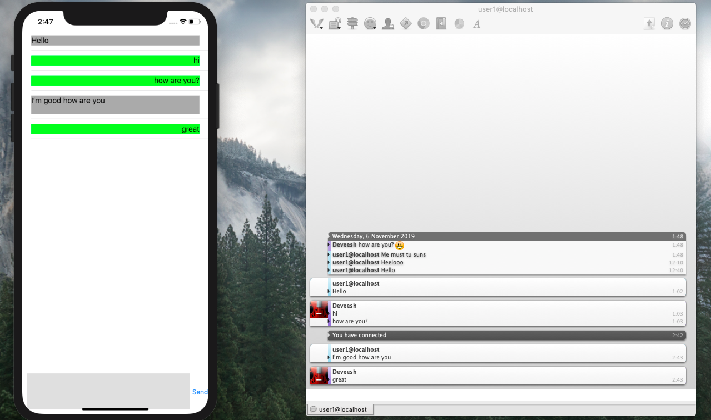

# Basic-iOS-Chat-Application-Using-XMPP-Ejjaberd-and-Adium
This is a very simple iOS chat application written in Swift 5.0. Ejjaberd is used for the server part and Adium is used the client.

## Final product:

## Getting Started
These instructions will get this chat application, your XMPP server and a client set up and running. It will allow chatting between 2 clients which we will set up as well.

## Development procedure:
1. ### Download ejjaberd: 
    1. [Download Ejjaberd](https://www.process-one.net/en/ejabberd/downloads/)
    2. I used ejjaberd 15.09 
2. ### Install ejjaberd:
    1. Open the dmg file
    2. Select your preferred language
    3. Click next
    4. Accept agreement -> Next
    5. Choose Installation Directory. I left it at default at 
        > /Applications/ejabberd-15.09 
        Then click next.
    6. Choose ejjaberd server domain. Write **"localhost"** without the quotes. You can choose something else too.
    7. Choose admin username. You can leave it at default(**“admin”**) like I did.
    8. Choose admin password.
    9. For cluster choice, choose no since we don’t need this right now.
    10. Click Next and again Next and the installation starts.
3. ### Start ejjaberd:
    1. Open terminal and go to 
        > Applications/ejjaberd-15.09/bin
    2. We need to start the server now so type this in the terminal: 
    `./start`
    3. This will open a webpage for you with a text something like this:
            *"By default, the ejabberd Web Admin interface is enabled. You should be able to connect to the admin interface and log in with the user admin@localhost and the password you defined during the installation.”*
    4. Click on the **“admin interface”** hyperlink. This will take you to the admin dashboard.
    5. On the admin dashboard. Go to `Virtual Hosts -> localhosts -> Users.` This is the place from where you add new users to chat with. 
    6. We have to add 2 new users so that we can chat between them
            Write “user1” without quotes in the username section. And a password then. Click add user
            For the second user you must create a username which is same as the username of your machine. Mine is “Deveesh” hence I write that in there. Enter a password and click add user.
4. ### We are done with the server setup part now. Clone the repo to your local machine. We have to make 2 small changes to the code.
    1. Go to **“ViewController.swift”**. Change value of variable **“recieveruserName”** from **“deveesh@localhost”** and put in the name that you put in the admin console. In essence replace **“deveesh”** with your machine’s username.
    2. Inside **“ViewController.swift”** change the value of **“thisUsersPassword”** variable to the password you set for **“user1@localhost”** in the admin console.
5. ### Now we setup the client:
    1. To chat, we need at least 2 users. One will be the app you run in your simulator. Second client will be made using an easy to user software named **“Adium”**. 
    2. This makes a chatting client(which is somewhat like another user has opened the application on their device)
    3. Difference with Adium is that it will have **“deveesh@localhost”/“user_name_you_entered@localhost”** as its username.
    4. To setup Adium:
        1. [Download Adium](https://adium.im/)
        2. Open the dmg file.
        3. Click on the duck image or the Adium.app
        4. Wait for a few seconds and it will ask you your password. This is the password you entered in the admin console.
        5. Once you enter the correct password it will change the status of your Adium client to available.
        6. Go to admin console and on the add user screen.
        7. You will see that one of the user is now online. This is the Adium client.
6. ### Running the app and chatting:
    1. Run the app on the simulator.
    2. In the simulator type a message and click send.
    3. Adium will notify you of the message. 
    4. Type in a message in Adium and send it. 
    5. It will appear in the application.
7. ### Give yourself a pat on the back. Well Done! :D

